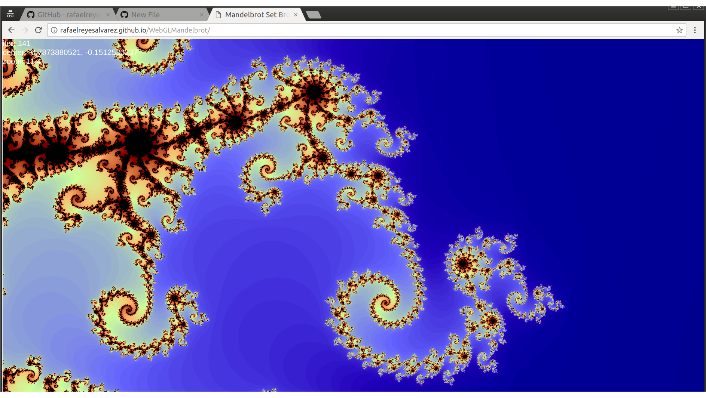

# WebGLMandelbrot
Mandelbrot Set fractal rendered in WebGL.

Check the live demo at http://rafaelreyesalvarez.github.io/WebGLMandelbrot/

- Pan dragging the cursor.
- Zoom using scroll.
- Change the maximum number of iterations with the -/+ keys.

Only tested with Chrome.
